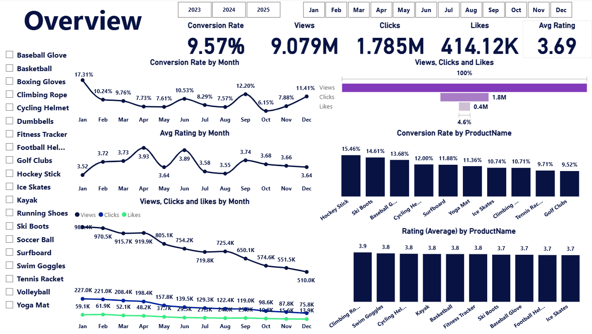
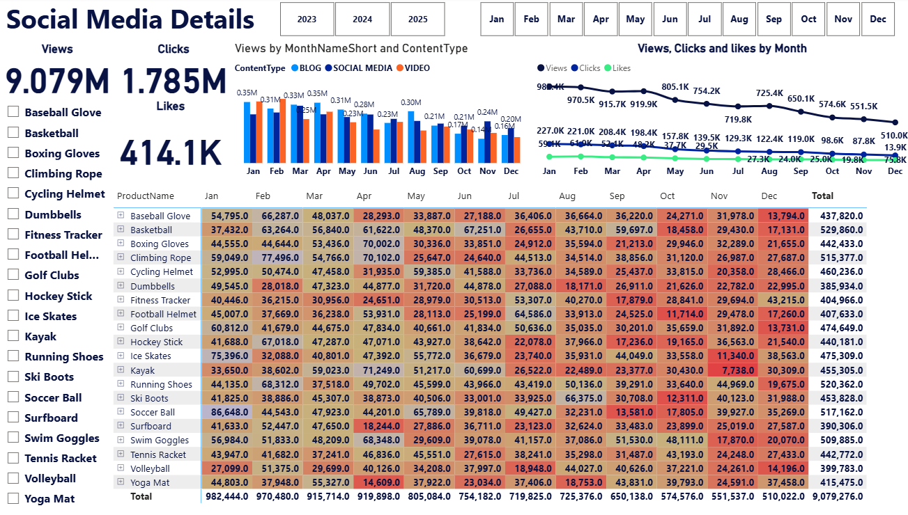
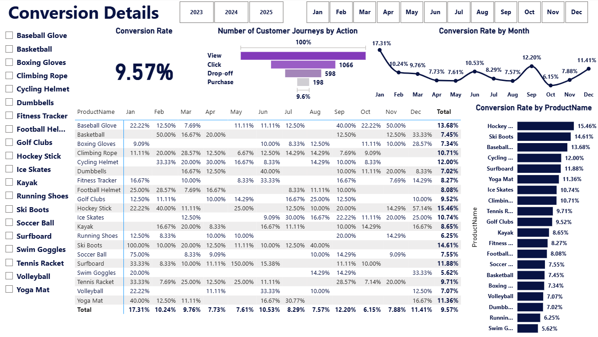
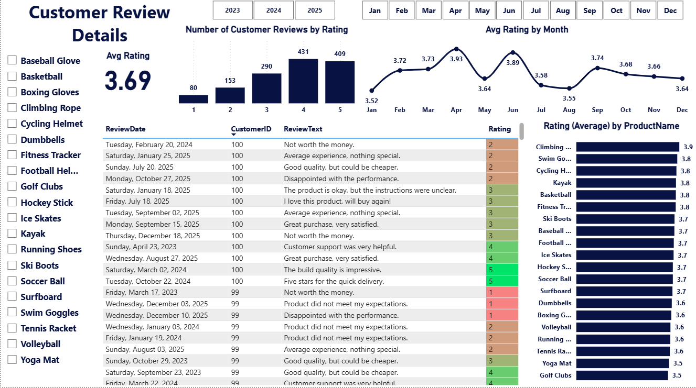

# Dashboard Guide

The Power BI report (`Marketing.pbix`) consists of **4 main pages** providing a comprehensive view of marketing performance and customer lifecycle. All pages share a consistent filtering experience with a left-hand product slicer and top navigation filters (Year, Month), ensuring seamless cross-page analysis.

---

## Page 1 — Overview

**Purpose:** A high-level executive summary combining key metrics across engagement, conversion, and customer satisfaction.

* **KPI cards:** Conversion Rate (9.57%) · Views (9.079M) · Clicks (1.785M) · Likes (414.12K) · Avg Rating (3.69)
* **Visuals:**
  * **Conversion Rate by Month & Avg Rating by Month:** Line charts showing the historical trend of conversions and ratings.
  * **Views, Clicks and Likes by Month:** A line chart comparing the three engagement metrics over time.
  * **Views, Clicks and Likes (Funnel):** A horizontal funnel/bar chart illustrating the drop-off from Views (100%) to Clicks (1.8M) to Likes (0.4M).
  * **Top Performers (Column Charts):** Two column charts highlighting `Conversion Rate by ProductName` and `Rating (Average) by ProductName` for quick identification of top-performing items.
* **Filters available:** Year (2023, 2024, 2025), Month (Jan-Dec), Product Name (Checkboxes).
* **How to use it:** Use this page for a single-glance business health check. Identify macro trends before diving into the specific detail pages.

---

## Page 2 — Social Media Details

**Purpose:** Evaluate top-of-funnel marketing performance and track user engagement across different content channels.

* **KPI cards:** Views (9.079M) · Clicks (1.785M) · Likes (414.1K)
* **Visuals:**
  * **Views by MonthNameShort and ContentType:** A clustered column chart comparing engagement across Blog, Social Media, and Video formats over time.
  * **Views, Clicks and likes by Month:** A trend line chart tracking the overall trajectory of all three engagement metrics throughout the year.
  * **Product Engagement Matrix:** A conditionally formatted table breaking down raw engagement numbers per product across each month.
* **Filters available:** Year (2023, 2024, 2025), Month (Jan-Dec), Product Name (Checkboxes).
* **How to use it:** Gauge overall brand reach. Use the Product Name slicer to isolate specific items and see which content type drives the most traffic for that product.

---

## Page 3 — Conversion Details

**Purpose:** Analyze the customer journey funnel to understand where users drop off and which products drive the highest purchasing success.

* **KPI cards:** Conversion Rate (9.57%)
* **Visuals:**
  * **Number of Customer Journeys by Action:** A funnel chart visualizing the drop-off at each stage: View (100%) -> Click -> Drop-off -> Purchase (9.6%).
  * **Conversion Rate by Month:** A line chart displaying how conversion efficiency fluctuates over time.
  * **Conversion Rate by ProductName:** A horizontal bar chart ranking products by their ability to convert (e.g., Hockey Stick at 15.46%).
  * **Conversion Matrix:** A detailed table showing the month-by-month conversion percentage for every single product in the catalog.
* **Filters available:** Year (2023, 2024, 2025), Month (Jan-Dec), Product Name (Checkboxes).
* **How to use it:** Identify funnel bottlenecks using the Funnel chart, then utilize the horizontal bar chart to find which products over-perform the 9.57% average.

---

## Page 4 — Customer Review Details

**Purpose:** Monitor brand sentiment, customer satisfaction, and gather qualitative feedback post-purchase.

* **KPI cards:** Avg Rating (3.69)
* **Visuals:**
  * **Number of Customer Reviews by Rating:** A column chart showing the distribution of scores from 1 to 5 stars, highlighting that 4-star reviews are the most frequent.
  * **Avg Rating by Month:** A line chart tracking historical customer satisfaction trends.
  * **Rating (Average) by ProductName:** A horizontal bar chart ranking products from highest rated to lowest.
  * **Review Details Table:** A granular, row-level view of actual customer feedback containing ReviewDate, CustomerID, ReviewText, and color-coded Ratings.
* **Filters available:** Year (2023, 2024, 2025), Month (Jan-Dec), Product Name (Checkboxes).
* **How to use it:** Cross-reference low-converting products from Page 3 with their average ratings here. Read the specific `ReviewText` to extract actionable product improvements.