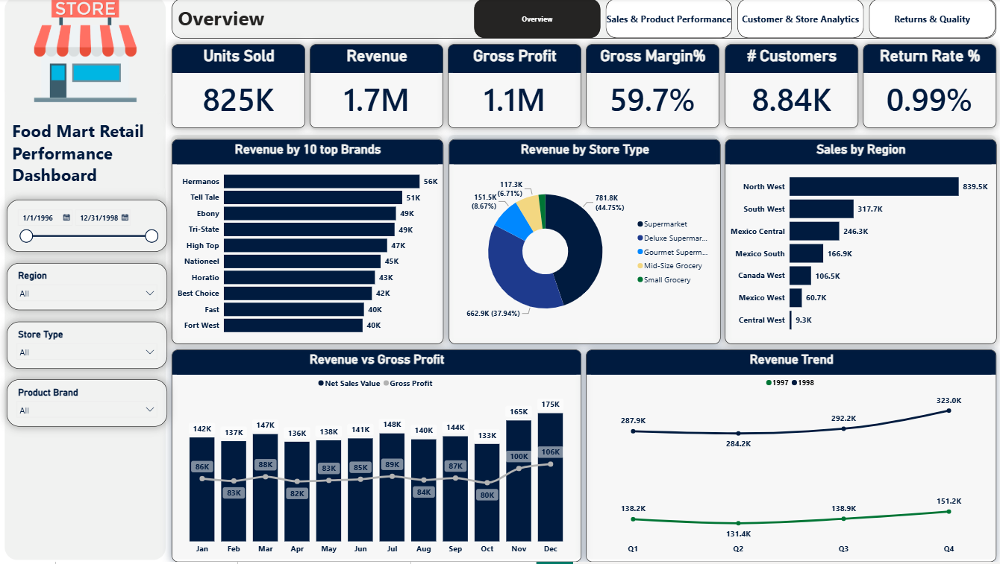
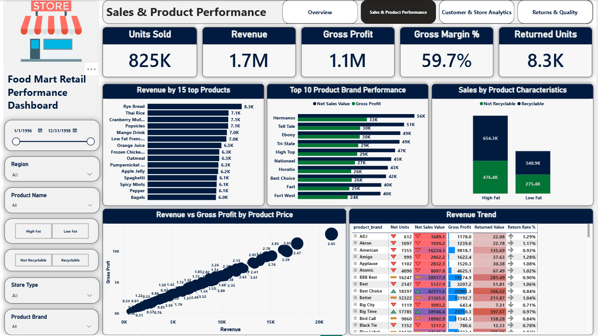
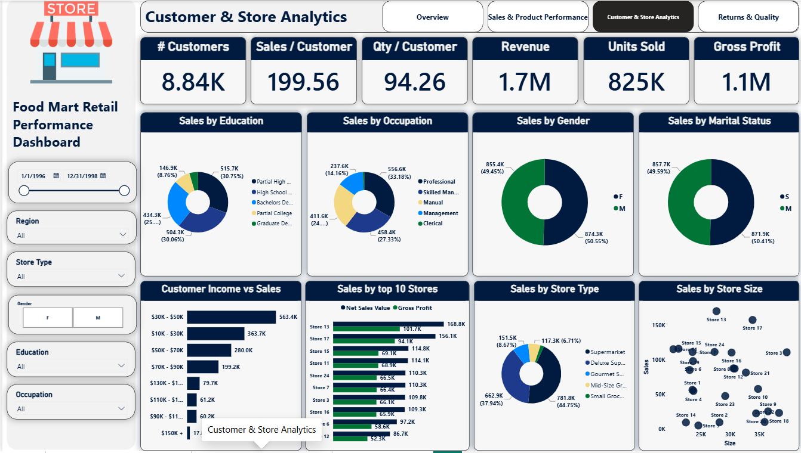
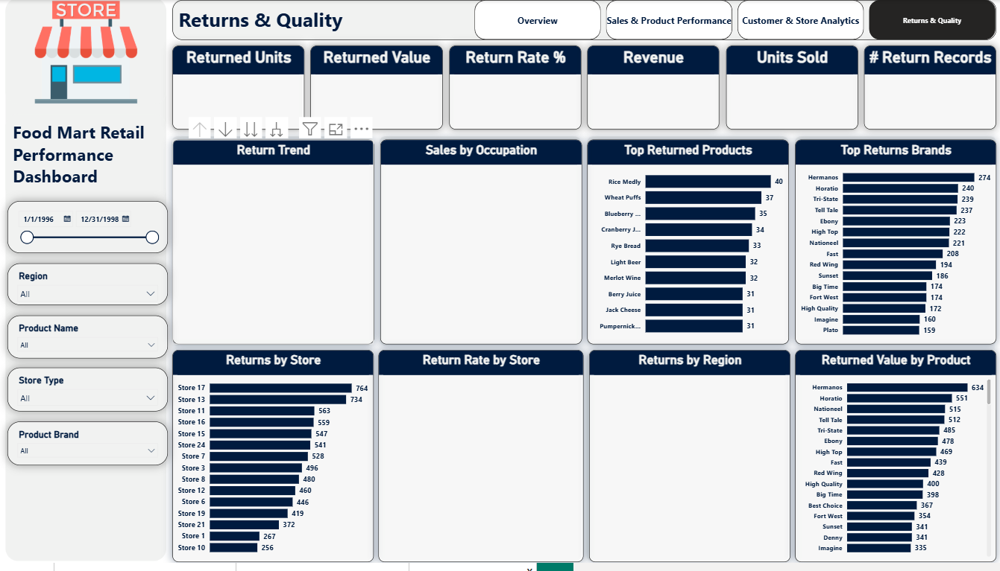

# Dashboard Guide

The Power BI report (`powerbi/Food_Mart_Retail_Performance.pbix`) has **4 pages**, each with its own KPI cards, visuals, and filter panel. All pages share a common left-hand filter panel (date range, region, product name, store type, product brand, and page-specific slicers like gender or high/low fat, recyclable/not recyclable) so filtering on one page's slicer set stays consistent with the others.

---

## Page 1 — Overview

**Purpose:** single-glance business health check for executives/stakeholders.

**KPI cards:** Units Sold · Revenue · Gross Profit · Gross Margin % · # Customers · Return Rate %

**Visuals:**
- **Revenue by 10 top Brands** — horizontal bar, ranks brands by revenue to spot top performers at a glance.
- **Revenue by Store Type** — donut chart, shows format mix (Supermarket, Deluxe Supermarket, Gourmet Supermarket, Mid-Size Grocery, Small Grocery).
- **Sales by Region** — horizontal bar, regional demand comparison.
- **Revenue vs Gross Profit** — dual-line/bar combo by month, tracks the relationship between top-line revenue and bottom-line profit through the year.
- **Revenue Trend** — line chart by quarter, split by year (1997 vs 1998), for year-over-year seasonal comparison.

**Filters available:** Date range slider, Region, Store Type, Product Brand.

**How to use it:** Start here to get overall figures, then click into a bar/slice (e.g., a specific region or store type) to cross-filter every visual on the page and jump to a deeper page for that same selection.

---

## Page 2 — Sales & Product Performance

**Purpose:** identify which products, brands, and price points are driving (or dragging down) sales and profit.

**KPI cards:** Units Sold · Revenue · Gross Profit · Gross Margin % · Returned Units

**Visuals:**
- **Revenue by 15 top Products** — horizontal bar ranking individual SKUs (e.g., "Rye Bread", "Thai Rice") by revenue.
- **Top 10 Product Brand Performance** — dual bar (Net Sales Value vs. Gross Profit) per brand, for comparing revenue-generation vs. profit-generation by brand.
- **Sales by Product Characteristics** — stacked bar comparing Not Recyclable/Recyclable across High Fat/Low Fat segments — a quick view of packaging and nutrition-attribute mix.
- **Revenue vs Gross Profit by Product Price** — scatter plot, each point a product priced along the x-axis (revenue) vs. y-axis (gross profit), sized/labeled by price point — reveals the price-to-profitability curve and any outliers.
- **Revenue Trend (table)** — a sortable, conditionally-formatted table by `product_brand` showing Net Units, Net Sales Value, Gross Profit, Returned Value, and Return Rate % side by side — the most granular view in the whole report, useful for brand-level deep dives.

**Filters available:** Date range, Region, Product Name, High Fat/Low Fat toggle, Not Recyclable/Recyclable toggle, Store Type, Product Brand.

**How to use it:** Use the table on the bottom-right as the analytical anchor — sort by Return Rate % or Gross Profit to find brands that need attention, then cross-reference against the bar charts above for context.

---

## Page 3 — Customer & Store Analytics

**Purpose:** understand who the customers are and which stores/regions perform best.

**KPI cards:** # Customers · Sales/Customer · Qty/Customer · Revenue · Units Sold · Gross Profit

**Visuals:**
- **Sales by Education** — donut chart across 5 education levels.
- **Sales by Occupation** — donut chart across 5 occupation categories.
- **Sales by Gender** — donut chart (F/M split).
- **Sales by Marital Status** — donut chart (S/M split).
- **Customer Income vs Sales** — horizontal bar by income band ($10K–$30K through $150K+), shows which income segments drive the most revenue.
- **Sales by top 10 Stores** — dual bar (Net Sales Value vs. Gross Profit) ranking individual stores.
- **Sales by Store Type** — donut chart, same format-mix view as the Overview page for consistency.
- **Sales by Store Size** — scatter plot of stores by `grocery_sqft` (x-axis) vs. Sales (y-axis), useful for spotting whether bigger stores actually sell more, or whether some small stores overperform their footprint.

**Filters available:** Date range, Region, Store Type, Gender toggle, Education, Occupation.

**How to use it:** Pair the demographic donuts with the income-band bar chart to build a customer profile, then check the store-size scatter to see if physical footprint or location matters more than customer mix for a given store's performance.

---

## Page 4 — Returns & Quality

**Purpose:** monitor product returns as a proxy for quality issues and lost revenue.

**KPI cards:** Returned Units · Returned Value · Return Rate % · Revenue · Units Sold · # Return Records

**Visuals:**
- **Return Trend** — time series of returns (title only in current build — `TODO`: chart appeared empty in the captured screenshot; verify it renders with data/filters applied in Power BI Desktop).
- **Sales by Occupation** — donut, repeated from page 3 for return-context filtering (`TODO`: same empty-render note as above).
- **Top Returned Products** — horizontal bar of the 10 most-returned SKUs by unit count (e.g., "Rice Medly", "Wheat Puffs").
- **Top Returns Brands** — horizontal bar of the top 15 brands by return volume.
- **Returns by Store** — horizontal bar ranking stores by return volume (Store 17 and Store 13 lead).
- **Return Rate by Store** — (`TODO`: chart appeared empty in the captured screenshot; verify.)
- **Returns by Region** — (`TODO`: chart appeared empty in the captured screenshot; verify.)
- **Returned Value by Product** — horizontal bar of top brands ranked by dollar value of returns, not just unit count — a better proxy for financial impact than raw return counts.

**Filters available:** Date range, Region, Product Name, Store Type, Product Brand.

**How to use it:** Use **Returned Value by Product** (dollar impact) rather than **Top Returned Products** (unit count) when prioritizing which SKUs/brands need a quality or vendor review, since a high-unit-count return on a cheap item may matter less than fewer returns on an expensive one.

> **`TODO` for the analyst:** Three visuals on this page (Return Trend, Sales by Occupation, Return Rate by Store, Returns by Region) rendered without visible data in the screenshot used for this documentation — likely a filter context or a rendering/scroll artifact at capture time. Please re-check these visuals directly in Power BI Desktop and update this guide once confirmed.

---

## Cross-Page Navigation
All four pages share a consistent top navigation bar (Overview / Sales & Product Performance / Customer & Store Analytics / Returns & Quality), letting users move between views without losing their place. Filter panel selections (region, store type, product brand, date range) are page-scoped in the current build — **`TODO`**: confirm whether a "Sync Slicers" configuration is applied so that a region selected on one page carries over to the next, or whether this is intentionally independent per page.
