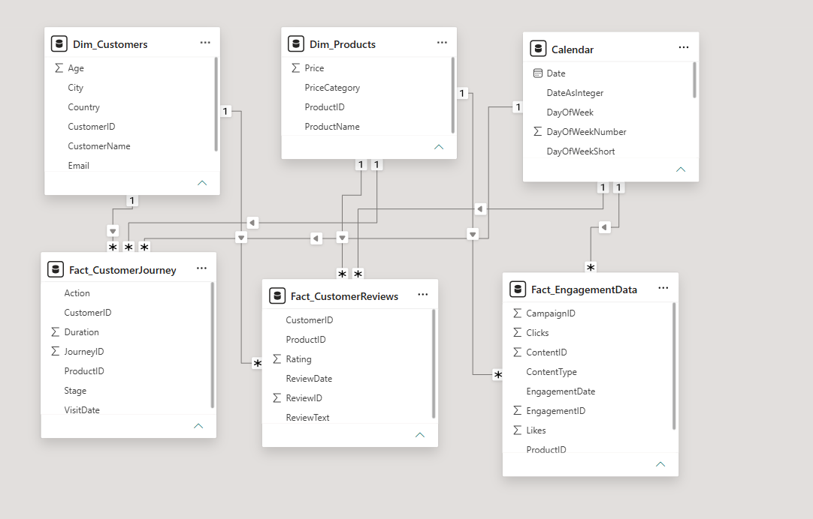

# Power BI Data Model Documentation

## Star Schema

**Fact tables (3):**
- `Fact_CustomerJourney` — tracks user actions and session duration
- `Fact_CustomerReviews` — captures product ratings and text reviews
- `Fact_EngagementData` — records social media interactions

**Dimension tables (3):**
- `Calendar`
- `Dim_Products`
- `Dim_Customers`

## Relationships

| From (fact) | Key | To (dimension) | Cardinality | Cross-filter direction |
|---|---|---|---|---|
| `Fact_CustomerJourney` | `CustomerID` | `Dim_Customers.CustomerID` | Many-to-one | Single |
| `Fact_CustomerJourney` | `ProductID` | `Dim_Products.ProductID` | Many-to-one | Single |
| `Fact_CustomerJourney` | `VisitDate` | `Calendar.Date` | Many-to-one | Single |
| `Fact_CustomerReviews` | `CustomerID` | `Dim_Customers.CustomerID` | Many-to-one | Single |
| `Fact_CustomerReviews` | `ProductID` | `Dim_Products.ProductID` | Many-to-one | Single |
| `Fact_CustomerReviews` | `ReviewDate` | `Calendar.Date` | Many-to-one | Single |
| `Fact_EngagementData` | `ProductID` | `Dim_Products.ProductID` | Many-to-one | Single |
| `Fact_EngagementData` | `EngagementDate` | `Calendar.Date` | Many-to-one | Single |

> All relationship arrows in the diagram point from the dimension tables' "1" side into the fact tables' "many" side, consistent with a standard star schema. 

## Measures

The following measure names were confirmed directly from the field references embedded in the report's visuals:

| Measure | Used on page(s) |
|---|---|
| `Views` | Social Media Details |
| `Clicks` | Social Media Details |
| `Likes` | Social Media Details |
| `Conversion Rate` | Conversion Details |
| `Number of Customer Journeys by Action` | Conversion Details |
| `Avg Rating` | Customer Review Details |
| `Number of Customer Reviews by Rating` | Customer Review Details |
