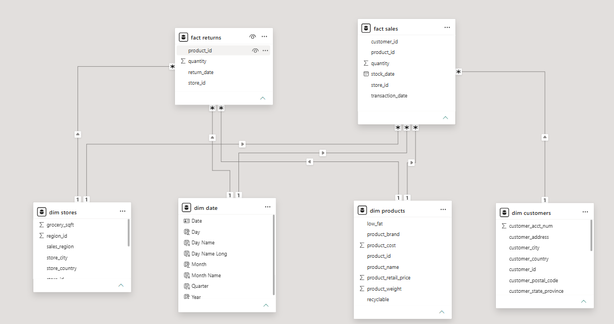

# Power BI Data Model Documentation

## Star Schema



**Fact tables (2):**
- `fact sales` — transaction grain
- `fact returns` — return-transaction grain

**Dimension tables (4):**
- `dim date`
- `dim products`
- `dim stores`
- `dim customers`

## Relationships

| From (fact) | Key | To (dimension) | Cardinality | Cross-filter direction |
|---|---|---|---|---|
| `fact sales` | `customer_id` | `dim customers.customer_id` | Many-to-one | Single (`TODO`: confirm if bidirectional) |
| `fact sales` | `product_id` | `dim products.product_id` | Many-to-one | Single |
| `fact sales` | `store_id` | `dim stores.store_id` | Many-to-one | Single |
| `fact sales` | `transaction_date` | `dim date.Date` | Many-to-one | Single |
| `fact returns` | `product_id` | `dim products.product_id` | Many-to-one | Single |
| `fact returns` | `store_id` | `dim stores.store_id` | Many-to-one | Single |
| `fact returns` | `return_date` | `dim date.Date` | Many-to-one | Single |

> All relationship arrows in the diagram point from the dimension tables' "1" side into the fact tables' "many" side, consistent with a standard star schema. Exact cross-filter direction (single vs. both) per relationship should be confirmed in Power BI Desktop → Model view → click each relationship line. **`TODO`**.

## Measures (`_measures` table)

The report uses a dedicated, hidden **`_measures`** table to hold all DAX measures rather than scattering them across the fact tables — a recommended Power BI modeling best practice for discoverability and maintenance.

The following measure names were confirmed directly from the field references embedded in the report's visuals (`Report/Layout`):

| Measure | Used on page(s) |
|---|---|
| `Units Sold` | Overview, Sales & Product Performance, Customer & Store Analytics, Returns & Quality |
| `Net Sales Value` / `Sales Value` | All pages |
| `Gross Profit` | All pages |
| `Gross Margin %` | Overview, Sales & Product Performance |
| `Active Customers` | Overview, Customer & Store Analytics |
| `Return Rate %` | Overview, Returns & Quality |
| `Returned Units` | Sales & Product Performance, Returns & Quality |
| `Returned Value` | Returns & Quality |
| `Return Records` | Returns & Quality |
| `Sales Value per Customer` | Customer & Store Analytics |
| `Units per Customer` | Customer & Store Analytics |
| `Net Units` | Sales & Product Performance (Revenue Trend table) |

### `TODO`: Add exact DAX formula text

The formula bodies below are **not verified against the actual model** — the compiled `.pbix` `DataModel` file is a binary xVelocity store and its DAX expressions are not plain-text-extractable outside of Power BI itself. To finish this documentation properly:

1. Open `powerbi/Food_Mart_Retail_Performance.pbix` in Power BI Desktop.
2. Go to the **Model** view → select the `_measures` table.
3. For each measure, copy the formula from the formula bar.
4. Paste each one into the table below, replacing the placeholder.

```dax
-- Units Sold
Units Sold = TODO

-- Net Sales Value
Net Sales Value = TODO

-- Gross Profit
Gross Profit = TODO

-- Gross Margin %
Gross Margin % = TODO

-- Active Customers
Active Customers = TODO

-- Return Rate %
Return Rate % = TODO

-- Returned Units
Returned Units = TODO

-- Returned Value
Returned Value = TODO

-- Return Records
Return Records = TODO

-- Sales Value per Customer
Sales Value per Customer = TODO

-- Units per Customer
Units per Customer = TODO

-- Net Units
Net Units = TODO
```

## Report Pages
1. `Overview`
2. `Sales & Product Performance`
3. `Customer & Store Analytics`
4. `Returns & Quality`

(Confirmed directly from `Report/Layout` page definitions in the `.pbix` file.)

## Slicers / Filter Fields Used Across the Report
Confirmed directly from field references in the report visuals:

- `dim date.Date`, `Month Name`, `Quarter`, `Year`
- `dim products.product_name`, `product_brand`, `low_fat`, `recyclable`, `product_retail_price`
- `dim stores.sales_region`, `store_type`, `store_name`, `total_sqft`
- `dim customers.gender`, `marital_status`, `education`, `occupation`, `yearly_income`
